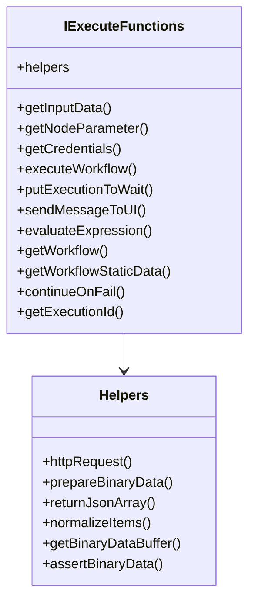

# IExecuteFunctions

The primary execution context for regular n8n nodes. This interface provides access to all the methods and helpers needed to implement the `execute()` method of a node.

## When to Use

`IExecuteFunctions` is used in:
- The `execute()` method of regular nodes
- Custom operation functions in declarative nodes
- Any node that processes multiple items

```ts
export async function execute(this: IExecuteFunctions): Promise<INodeExecutionData[][]> {
  // Your node logic here
}
```

## Interface Overview



## Core Methods

### Data Access

#### `getInputData(inputIndex?, connectionType?)`
Gets the input data for the node.

```ts
getInputData(inputIndex?: number, connectionType?: NodeConnectionType): INodeExecutionData[]
```

**Parameters:**
- `inputIndex` - Which input to get data from (default: 0)
- `connectionType` - Type of connection (default: 'main')

**Example:**
```ts
const items = this.getInputData();
// Process each item
for (let i = 0; i < items.length; i++) {
  const item = items[i];
  console.log(item.json); // The JSON data
  console.log(item.binary); // Any binary data
}
```

#### `getNodeParameter(parameterName, itemIndex, fallbackValue?, options?)`
Gets a parameter value configured by the user.

```ts
getNodeParameter(
  parameterName: string,
  itemIndex: number,
  fallbackValue?: any,
  options?: IGetNodeParameterOptions
): NodeParameterValueType | object
```

**Parameters:**
- `parameterName` - Name of the parameter
- `itemIndex` - Index of the current item being processed
- `fallbackValue` - Default value if parameter is not set
- `options` - Additional options for parameter retrieval

**Example:**
```ts
const operation = this.getNodeParameter('operation', 0) as string;
const limit = this.getNodeParameter('limit', 0, 100) as number;
const options = this.getNodeParameter('additionalFields', 0, {}) as IDataObject;
```

**Type-Safe Overloads:**
```ts
// String parameters
const resource = this.getNodeParameter('resource', itemIndex) as string;

// Boolean parameters  
const returnAll = this.getNodeParameter('returnAll', itemIndex) as boolean;

// Number parameters
const limit = this.getNodeParameter('limit', itemIndex) as number;

// Object parameters
const filters = this.getNodeParameter('filters', itemIndex, {}) as IDataObject;
```

### Credentials

#### `getCredentials(type, itemIndex?)`
Gets decrypted credentials for the specified type.

```ts
getCredentials<T extends object = ICredentialDataDecryptedObject>(
  type: string,
  itemIndex?: number
): Promise<T>
```

**Example:**
```ts
const credentials = await this.getCredentials('httpBasicAuth');
const username = credentials.user as string;
const password = credentials.password as string;

// Type-safe approach
interface MyApiCredentials {
  apiKey: string;
  baseUrl: string;
}

const creds = await this.getCredentials<MyApiCredentials>('myApi');
console.log(creds.apiKey); // TypeScript knows this is a string
```

### Workflow Control

#### `executeWorkflow(workflowInfo, inputData?, parentCallbackManager?, options?)`
Executes another workflow from within the current node.

```ts
executeWorkflow(
  workflowInfo: IExecuteWorkflowInfo,
  inputData?: INodeExecutionData[],
  parentCallbackManager?: CallbackManager,
  options?: {
    doNotWaitToFinish?: boolean;
    parentExecution?: RelatedExecution;
  }
): Promise<ExecuteWorkflowData>
```

**Example:**
```ts
const result = await this.executeWorkflow(
  { id: 'workflow-id-123' },
  [{ json: { message: 'Hello from parent workflow' } }]
);

console.log(result.data); // Results from the sub-workflow
```

#### `putExecutionToWait(waitTill)`
Pauses the workflow execution until a specified time.

```ts
putExecutionToWait(waitTill: Date): Promise<void>
```

**Example:**
```ts
// Wait for 5 minutes
const waitUntil = new Date(Date.now() + 5 * 60 * 1000);
await this.putExecutionToWait(waitUntil);
```

### Expression Evaluation

#### `evaluateExpression(expression, itemIndex)`
Evaluates an n8n expression in the context of the current item.

```ts
evaluateExpression(expression: string, itemIndex: number): NodeParameterValueType
```

**Example:**
```ts
const result = this.evaluateExpression('{{ $json.name.toUpperCase() }}', 0);
const timestamp = this.evaluateExpression('{{ $now }}', 0);
const itemCount = this.evaluateExpression('{{ $items.length }}', 0);
```

### Metadata Access

#### `getWorkflow()`
Gets metadata about the current workflow.

```ts
getWorkflow(): IWorkflowMetadata
```

**Example:**
```ts
const workflow = this.getWorkflow();
console.log(workflow.name); // Workflow name
console.log(workflow.active); // Whether workflow is active
console.log(workflow.id); // Workflow ID
```

#### `getNode()`
Gets information about the current node.

```ts
getNode(): INode
```

**Example:**
```ts
const node = this.getNode();
console.log(node.name); // Node name
console.log(node.type); // Node type
console.log(node.parameters); // Node parameters
```

#### `getExecutionId()`
Gets the current execution ID.

```ts
getExecutionId(): string
```

**Example:**
```ts
const executionId = this.getExecutionId();
console.log(`Processing in execution: ${executionId}`);
```

### Error Handling

#### `continueOnFail()`
Checks if the node should continue on failure.

```ts
continueOnFail(): boolean
```

**Example:**
```ts
try {
  // Risky operation
  await this.helpers.httpRequest(options);
} catch (error) {
  if (this.continueOnFail()) {
    return [{ json: { error: error.message } }];
  }
  throw error;
}
```

### UI Communication

#### `sendMessageToUI(message)`
Sends a message to the n8n UI (useful for progress updates).

```ts
sendMessageToUI(message: any): void
```

**Example:**
```ts
this.sendMessageToUI(`Processing item ${i + 1} of ${items.length}`);
```

#### `sendResponse(response)`
Sends a response back to the caller (for webhook nodes).

```ts
sendResponse(response: IExecuteResponsePromiseData): void
```

## Helpers Object

The `helpers` object provides utility functions for common operations:

### HTTP Helpers
```ts
// Make HTTP requests
await this.helpers.httpRequest(options);
await this.helpers.httpRequestWithAuthentication('credentialType', options);
```

### Binary Helpers
```ts
// Prepare binary data
const binaryData = await this.helpers.prepareBinaryData(buffer, 'file.pdf');

// Get binary data as buffer
const buffer = await this.helpers.getBinaryDataBuffer(itemIndex, 'data');

// Assert binary data exists
const binaryData = this.helpers.assertBinaryData(itemIndex, 'data');
```

### Utility Helpers
```ts
// Return data as array
return this.helpers.returnJsonArray(data);

// Normalize items
const normalized = this.helpers.normalizeItems(items);

// Construct execution metadata
const withMetadata = this.helpers.constructExecutionMetaData(inputData, {
  itemData: { item: 0 }
});
```

## Complete Example

```ts
import {
  IExecuteFunctions,
  INodeExecutionData,
  INodeType,
  INodeTypeDescription,
  NodeOperationError,
} from 'n8n-workflow';

export class ExampleNode implements INodeType {
  description: INodeTypeDescription = {
    displayName: 'Example Node',
    name: 'exampleNode',
    group: ['transform'],
    version: 1,
    description: 'Example node using IExecuteFunctions',
    defaults: { name: 'Example Node' },
    inputs: ['main'],
    outputs: ['main'],
    properties: [
      {
        displayName: 'Operation',
        name: 'operation',
        type: 'options',
        options: [
          { name: 'Get Data', value: 'getData' },
          { name: 'Process Data', value: 'processData' },
        ],
        default: 'getData',
      },
      {
        displayName: 'API URL',
        name: 'apiUrl',
        type: 'string',
        default: 'https://api.example.com',
        displayOptions: {
          show: { operation: ['getData'] },
        },
      },
    ],
    credentials: [
      {
        name: 'httpBasicAuth',
        required: true,
      },
    ],
  };

  async execute(this: IExecuteFunctions): Promise<INodeExecutionData[][]> {
    const items = this.getInputData();
    const returnData: INodeExecutionData[] = [];
    const operation = this.getNodeParameter('operation', 0) as string;

    // Get credentials
    const credentials = await this.getCredentials('httpBasicAuth');

    for (let i = 0; i < items.length; i++) {
      try {
        if (operation === 'getData') {
          const apiUrl = this.getNodeParameter('apiUrl', i) as string;
          
          // Make HTTP request with authentication
          const response = await this.helpers.httpRequestWithAuthentication(
            'httpBasicAuth',
            {
              method: 'GET',
              url: apiUrl,
              json: true,
            }
          );

          returnData.push({
            json: response,
            pairedItem: { item: i },
          });

        } else if (operation === 'processData') {
          const inputData = items[i].json;
          
          // Process the data
          const processedData = {
            ...inputData,
            processed: true,
            processedAt: new Date().toISOString(),
            executionId: this.getExecutionId(),
          };

          returnData.push({
            json: processedData,
            pairedItem: { item: i },
          });
        }

        // Send progress update
        this.sendMessageToUI(`Processed item ${i + 1} of ${items.length}`);

      } catch (error) {
        if (this.continueOnFail()) {
          returnData.push({
            json: { error: error.message },
            pairedItem: { item: i },
          });
        } else {
          throw new NodeOperationError(this.getNode(), error.message, { itemIndex: i });
        }
      }
    }

    return [returnData];
  }
}
```

## Best Practices

### Error Handling
```ts
try {
  // Your operation
} catch (error) {
  if (this.continueOnFail()) {
    return [{ json: { error: error.message } }];
  }
  throw new NodeOperationError(this.getNode(), error.message, { itemIndex: i });
}
```

### Type Safety
```ts
// Use type assertions for known parameter types
const operation = this.getNodeParameter('operation', i) as string;
const limit = this.getNodeParameter('limit', i, 100) as number;

// Use interfaces for complex credentials
interface MyApiCredentials {
  apiKey: string;
  baseUrl: string;
}
const creds = await this.getCredentials<MyApiCredentials>('myApi');
```

### Performance
```ts
// Process items in batches for large datasets
const batchSize = 100;
for (let i = 0; i < items.length; i += batchSize) {
  const batch = items.slice(i, i + batchSize);
  // Process batch
}
```

### Paired Items
```ts
// Always include pairedItem for data lineage
returnData.push({
  json: processedData,
  pairedItem: { item: i },
});
```

## See Also

- [IExecuteSingleFunctions](./IExecuteSingleFunctions) - Single-item execution context
- [HTTP Helpers](../helpers/http) - Making HTTP requests
- [Binary Helpers](../helpers/binary) - Working with binary data
- [Error Handling](../../advanced/ErrorHandling) - Robust error management
