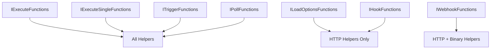

# Helper Functions Overview

Helper functions are utility methods available through the `helpers` object in all execution contexts. They provide common functionality for HTTP requests, binary data handling, file operations, and more.

## Categories

### 🌐 **HTTP Helpers**
Make HTTP requests with authentication and error handling:
- **[httpRequest](./http.md#httprequest)** - Modern HTTP requests
- **[httpRequestWithAuthentication](./http.md#httprequestwithauthentication)** - Authenticated requests
- **[requestWithAuthenticationPaginated](./http.md#requestwithauthenticationpaginated)** - Paginated API calls

### 📁 **Binary Helpers**
Work with files and binary data:
- **[prepareBinaryData](./binary.md#preparebinarydata)** - Create binary data objects
- **[getBinaryDataBuffer](./binary.md#getbinarydatabuffer)** - Get binary data as Buffer
- **[assertBinaryData](./binary.md#assertbinarydata)** - Safely access binary data
- **[binaryToString](./binary.md#binarytostring)** - Convert binary to text

### 💾 **Filesystem Helpers**
File system operations:
- **[createReadStream](./filesystem.md#createreadstream)** - Create file read streams
- **[writeContentToFile](./filesystem.md#writecontenttofile)** - Write data to files
- **[createDirIfNotExists](./filesystem.md#createdirifnotexists)** - Create directories

### 🔄 **Deduplication Helpers**
Prevent duplicate processing:
- **[checkProcessedAndRecord](./deduplication.md#checkprocessedandrecord)** - Check and record items
- **[clearAllProcessedItems](./deduplication.md#clearallprocesseditems)** - Clear processed history

### 🛠️ **Base Helpers**
Core utility functions:
- **[returnJsonArray](./base#returnjsonarray)** - Format return data
- **[normalizeItems](./base#normalizeitems)** - Normalize item structure
- **[constructExecutionMetaData](./base#constructexecutionmetadata)** - Add execution metadata

## Quick Examples

### Making HTTP Requests
```ts
// Simple GET request
const response = await this.helpers.httpRequest({
  method: 'GET',
  url: 'https://api.example.com/data',
});

// Authenticated request
const response = await this.helpers.httpRequestWithAuthentication(
  'apiKeyAuth',
  {
    method: 'POST',
    url: 'https://api.example.com/create',
    body: { name: 'New Item' },
  }
);
```

### Working with Binary Data
```ts
// Download and prepare binary data
const response = await this.helpers.httpRequest({
  method: 'GET',
  url: 'https://example.com/file.pdf',
  encoding: 'arraybuffer',
});

const binaryData = await this.helpers.prepareBinaryData(
  Buffer.from(response),
  'document.pdf',
  'application/pdf'
);

return [{
  json: { success: true },
  binary: { data: binaryData },
}];
```

### Processing Files
```ts
// Get binary data from input
const buffer = await this.helpers.getBinaryDataBuffer(0, 'data');

// Convert to text if it's a text file
const text = await this.helpers.binaryToString(buffer, 'utf8');

// Process the text content
const lines = text.split('\n');
const processedData = lines.map(line => ({ content: line.trim() }));

return this.helpers.returnJsonArray(processedData);
```

### Deduplication
```ts
// Check if item was already processed
const itemId = item.json.id as string;
const wasProcessed = await this.helpers.checkProcessedAndRecord(itemId);

if (wasProcessed) {
  // Skip this item
  continue;
}

// Process the item...
```

## Helper Context Availability

Different execution contexts have access to different helper methods:



### Full Helper Access
- `IExecuteFunctions`
- `IExecuteSingleFunctions`
- `ITriggerFunctions`
- `IPollFunctions`

### Limited Helper Access
- `ILoadOptionsFunctions` - HTTP helpers only
- `IWebhookFunctions` - HTTP and binary helpers
- `IHookFunctions` - HTTP helpers only

## Error Handling

All helper functions can throw errors. Always wrap them in try-catch blocks:

```ts
try {
  const response = await this.helpers.httpRequest(options);
  // Process response
} catch (error) {
  if (this.continueOnFail()) {
    return [{ json: { error: error.message } }];
  }
  throw new NodeOperationError(this.getNode(), error.message);
}
```

## Performance Tips

### 1. Reuse HTTP Connections
```ts
// Good - reuse connection for multiple requests
const baseOptions = {
  headers: { 'Authorization': 'Bearer token' },
  timeout: 30000,
};

for (const item of items) {
  const response = await this.helpers.httpRequest({
    ...baseOptions,
    method: 'GET',
    url: `https://api.example.com/items/${item.id}`,
  });
}
```

### 2. Stream Large Files
```ts
// Good - use streams for large files
const stream = this.helpers.createReadStream(filePath);
const binaryData = await this.helpers.prepareBinaryData(stream, filename);

// Bad - load entire file into memory
const buffer = readFileSync(filePath);
const binaryData = await this.helpers.prepareBinaryData(buffer, filename);
```

### 3. Batch Operations
```ts
// Good - batch multiple items
const batchSize = 100;
for (let i = 0; i < items.length; i += batchSize) {
  const batch = items.slice(i, i + batchSize);
  await processBatch(batch);
}
```

## Best Practices

### 1. Type Safety
```ts
// Define interfaces for API responses
interface ApiResponse {
  data: Array<{ id: string; name: string }>;
  pagination: { page: number; total: number };
}

const response = await this.helpers.httpRequest(options) as ApiResponse;
```

### 2. Proper Error Messages
```ts
try {
  const response = await this.helpers.httpRequest(options);
} catch (error) {
  throw new NodeOperationError(
    this.getNode(),
    `Failed to fetch data from API: ${error.message}`,
    { itemIndex: i }
  );
}
```

### 3. Resource Cleanup
```ts
// Always clean up resources
let stream: Readable | undefined;
try {
  stream = this.helpers.createReadStream(filePath);
  // Process stream
} finally {
  if (stream) {
    stream.destroy();
  }
}
```

## See Also

- **[HTTP Helpers](./http)** - Detailed HTTP request documentation
- **[Binary Helpers](./binary)** - Binary data handling
- **[IExecuteFunctions](../execution-contexts/IExecuteFunctions)** - Main execution context
- **[Error Handling](../../advanced/ErrorHandling)** - Robust error management
