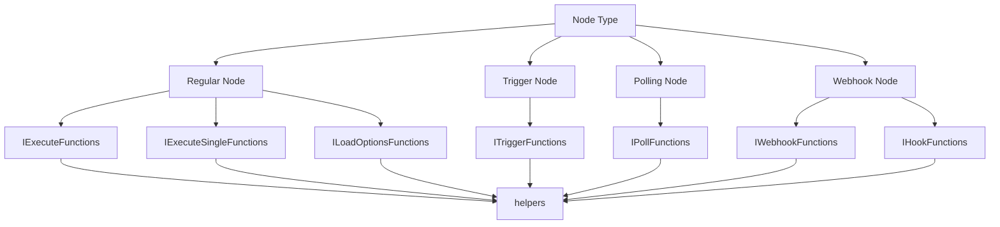

# Public Node API Reference

This section documents the complete public API available to n8n node developers. These interfaces and methods are stable, officially supported, and safe to use in custom nodes.

## Overview

When developing custom n8n nodes, you have access to different execution contexts depending on the type of node and method you're implementing:



## Quick Navigation

### 🎯 **Execution Contexts**
Different interfaces available depending on your node type:
- **[IExecuteFunctions](./execution-contexts/IExecuteFunctions)** - Main execution context for regular nodes
- **[IExecuteSingleFunctions](./execution-contexts/IExecuteSingleFunctions)** - Single-item execution context
- **[ILoadOptionsFunctions](./execution-contexts/ILoadOptionsFunctions)** - Loading dynamic options
- **[ITriggerFunctions](./execution-contexts/ITriggerFunctions)** - Trigger node execution
- **[IPollFunctions](./execution-contexts/IPollFunctions)** - Polling node execution
- **[IWebhookFunctions](./execution-contexts/IWebhookFunctions)** - Webhook handling
- **[IHookFunctions](./execution-contexts/IHookFunctions)** - Webhook setup/teardown

### 🛠️ **Helper Functions**
Utility functions available via the `helpers` object:
- **[Binary Helpers](./helpers/binary)** - Working with binary data and files
- **[HTTP Helpers](./helpers/http)** - Making HTTP requests with authentication
- **[Filesystem Helpers](./helpers/filesystem)** - File system operations
- **[Deduplication Helpers](./helpers/deduplication)** - Preventing duplicate processing
- **[Base Helpers](./helpers/base)** - Core utility functions

### 📝 **Parameter Access**
Methods for accessing node parameters and evaluating expressions:
- **[getNodeParameter](./parameters/getNodeParameter)** - Access node configuration
- **[evaluateExpression](./parameters/evaluateExpression)** - Evaluate n8n expressions
- **[getCurrentNodeParameter](./parameters/getCurrentNodeParameter)** - Access current parameter values

### 🔄 **Workflow & Execution**
Methods for workflow control and execution:
- **[getWorkflow](./workflow/getWorkflow)** - Access workflow metadata
- **[getWorkflowStaticData](./workflow/getWorkflowStaticData)** - Persistent workflow data
- **[executeWorkflow](./workflow/executeWorkflow)** - Execute sub-workflows
- **[putExecutionToWait](./workflow/putExecutionToWait)** - Pause execution

### 🚀 **Advanced APIs**
Advanced functionality for specialized use cases:
- **[startJob](./advanced/startJob)** - Start background jobs
- **[logAiEvent](./advanced/logAiEvent)** - Log AI-related events
- **[sendMessageToUI](./advanced/sendMessageToUI)** - Send messages to the UI

### 📚 **Reference**
Type definitions and interface documentation:
- **[Common Types](./reference/types)** - Frequently used type definitions
- **[Full Interfaces](./reference/interfaces)** - Complete interface definitions

## API Stability

### ✅ **Stable & Supported**
All APIs documented in this section are:
- **Officially supported** by the n8n team
- **Stable** across minor version updates
- **Safe to use** in production nodes
- **Backwards compatible** within major versions

### ⚠️ **Version Compatibility**
- APIs may be added in new versions
- Deprecated APIs will be marked clearly
- Breaking changes only occur in major versions
- Check the `@since` tags for minimum version requirements

### 🔒 **Internal APIs**
Avoid using:
- Methods not documented here
- Methods prefixed with `_` or `__`
- Methods marked as `@internal`
- Direct access to internal properties

## Getting Started

If you're new to n8n node development, start with:

1. **[IExecuteFunctions](./execution-contexts/IExecuteFunctions)** - The main execution context
2. **[getNodeParameter](./parameters/getNodeParameter)** - Accessing user configuration
3. **[HTTP Helpers](./helpers/http)** - Making API calls
4. **[Binary Helpers](./helpers/binary)** - Working with files

## Examples

### Basic Node Execution
```ts
import { IExecuteFunctions, INodeExecutionData } from 'n8n-workflow';

export async function execute(this: IExecuteFunctions): Promise<INodeExecutionData[][]> {
  const items = this.getInputData();
  const returnData: INodeExecutionData[] = [];

  for (let i = 0; i < items.length; i++) {
    const name = this.getNodeParameter('name', i) as string;
    
    returnData.push({
      json: {
        message: `Hello, ${name}!`,
        timestamp: new Date().toISOString(),
      },
    });
  }

  return [returnData];
}
```

### Making HTTP Requests
```ts
const response = await this.helpers.httpRequest({
  method: 'GET',
  url: 'https://api.example.com/data',
  headers: {
    'Authorization': `Bearer ${token}`,
  },
});
```

### Working with Binary Data
```ts
const binaryData = await this.helpers.prepareBinaryData(
  buffer,
  'filename.pdf',
  'application/pdf'
);

return [{
  json: { success: true },
  binary: { data: binaryData },
}];
```

## Need Help?

- Check the specific API documentation for detailed examples
- Look at the [Real World Examples](../real-world/AirtopNode.md) for complete node implementations
- Review the [Patterns](../patterns/DeclarativePattern/overview.md) section for architectural guidance
- See [Error Handling](../advanced/ErrorHandling.md) for robust error management
